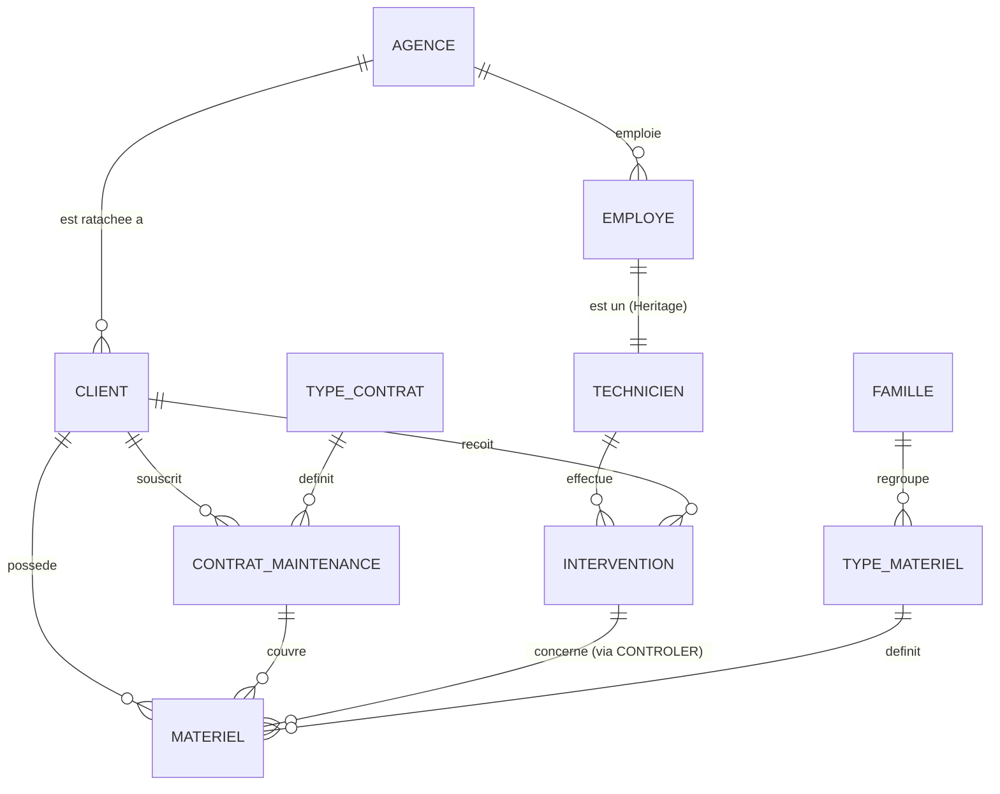

# Modélisation des Données - CashCash

Ce document présente les modèles conceptuels et relationnels de la base de données CashCash, en respectant les extensions Merise 2.

## 1. Modèle Conceptuel de Données (MCD)

Le MCD modélise les entités et leurs associations. Nous utilisons ici la notation Merise pour les cardinalités.

### Spécialisation (Héritage Merise 2)
Dans le système CashCash, l'entité **Employé** est une entité générique spécialisée en plusieurs rôles. L'héritage est de type **XT (Exclusif et Total)** : un employé a exactement un rôle parmi Technicien, Gestionnaire ou Admin.

---

## 2. Modèle Relationnel de Données (MLD)

Le MLD traduit les entités en tables et les associations en clés étrangères.

- **Agence** (#NumeroAgence, NomAgence, AdresseAgence, TelephoneAgence)
- **Client** (#NumeroClient, RaisonSociale, Adresse, TelephoneClient, Email, Siren, CodeApe, DistanceKM, DureeDeplacement, *#NumeroAgence*)
- **Employe** (#Matricule, NomEmploye, PrenomEmploye, AdresseEmploye, DateEmbauche, Email, mot_de_passe, Role, *#NumeroAgence*)
- **Technicien** (#Matricule, TelephoneMobile, Qualification, DateObtention)  
  *Note: La clé primaire #Matricule est aussi une clé étrangère vers Employe.*
- **Famille** (#CodeFamille, LibelleFamille)
- **TypeMateriel** (#ReferenceInterne, LibelleTypeMateriel, *#CodeFamille*)
- **TypeContrat** (#RefTypeContrat, DelaiIntervention, TauxApplicable)
- **ContratMaintenance** (#NumeroContrat, DateSignature, DateEcheance, *#NumeroClient*, *#RefTypeContrat*)
- **Materiel** (#NumeroSerie, DateInstallation, PrixVente, Emplacement, *#NumeroClient*, *#ReferenceInterneTypeMateriel*, *#NumeroContrat*)
- **Intervention** (#NumeroIntervent, DateVisite, HeureVisite, *#MatriculeTechnicien*, *#NumeroClient*)
- **Controler** (*#NumeroIntervent*, *#NumeroSerieMateriel*, TempsPasse, Commentaire)
  *Note: Clé primaire composée des deux clés étrangères.*

---

## 3. Justification de la "Gestion Stricte" (VDEV)

Conformément aux exigences de VDEV :
- **Contraintes d'intégrité** : Toutes les clés étrangères sont assorties de clauses `ON DELETE RESTRICT` pour éviter les orphelins.
- **Domaines** : Le champ `Role` de la table `Employe` est limité par une contrainte d'énumération.
- **Héritage** : L'héritage d'Employé vers Technicien est implémenté par une relation 1:1, garantissant que les données spécifiques aux techniciens ne sont stockées que pour eux.
