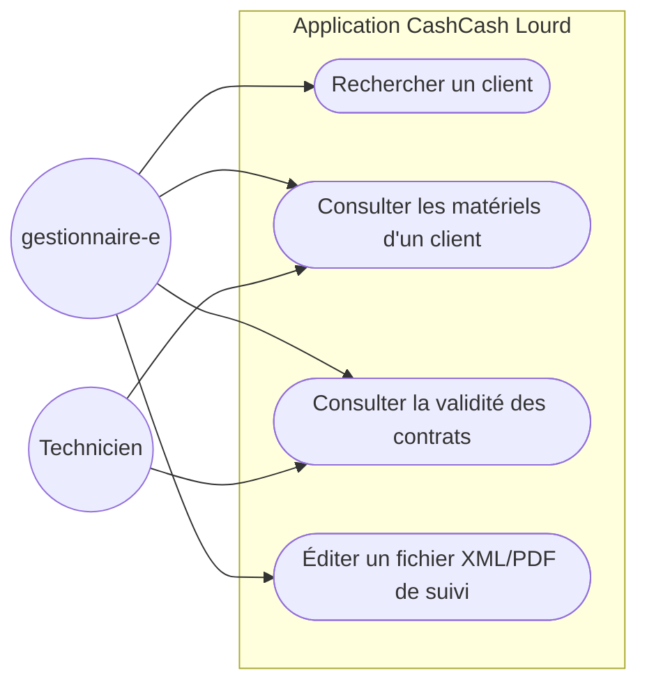
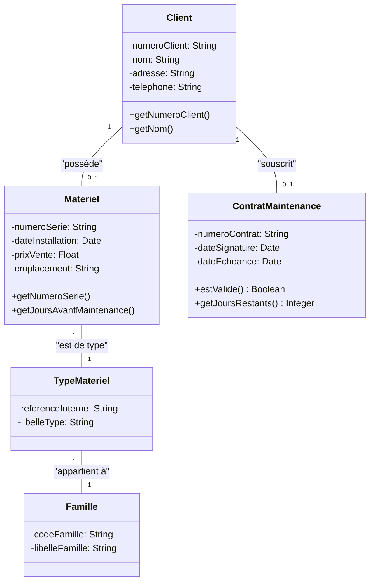

# Dossier de Spécifications et Conception - CashCash (Jalon 3)

Ce document de synthèse récapitule l'ensemble des réponses aux attentes et contraintes techniques formulées par VDEV pour le projet CashCash Lourd.

## 1. Choix de l'Architecture Logicielle Retenue

L'application s'appuie sur une **architecture client-serveur (Client Lourd)** organisée selon le modèle MVC avec une stricte séparation des responsabilités :
- **Frontend / Client Lourd** : L'interface est développée avec **Electron**, offrant une intégration native (bureau) tout en utilisant les technologies du web (HTML/CSS/JS). Les processus sont sécurisés : le *Main Process* gère le système de fichiers, et le *Renderer Process* (l'IHM) communique de façon asynchrone et isolée via un script `preload.js`.
- **Backend / API (Middleware)** : Un serveur Node.js avec **Express.js** (`server.js`) expose les Web Services (endpoints REST). Il sécurise et centralise l'accès aux données.
- **Persistance des Données** : Base de données relationnelle **MySQL**. L'application intègre une couche d'abstraction (`PersistanceSQL`) pour exécuter des requêtes préparées et parer aux injections SQL.
- **Génération de Documents** : Les rapports et l'export (PDF, XML) sont gérés de manière asynchrone via des librairies adaptées dans l'environnement Node.js/Electron.

---

## 2. Diagramme de Cas d'Utilisation

Le diagramme ci-dessous (réalisé avec Mermaid) modélise les interactions des acteurs avec le système CashCash.

### Description textuelle des cas d'utilisation

**Cas d'utilisation : Rechercher un client**
- **Acteur principal** : Gestionnaire(e)
- **Objectif** : Retrouver les informations détaillées d'un client à partir de son numéro ou de son nom.
- **Scénario nominal** : 
  1. L'gestionnaire saisit un numéro de client.
  2. Le système interroge l'API via l'IHM.
  3. Le système affiche la fiche client complète.
- **Exceptions** : Si le client n'existe pas, un message d'erreur est affiché : "Client introuvable".

**Cas d'utilisation : Consulter les matériels d'un client**
- **Acteur principal** : Gestionnaire(e) / Technicien
- **Objectif** : Voir la liste complète des équipements gérés pour un client précis.
- **Scénario nominal** : 
  1. L'utilisateur se rend sur la fiche d'un client.
  2. Le système récupère et affiche la liste de ses matériels (numéro de série, date d'installation, type).

**Cas d'utilisation : Éditer un fichier XML/PDF de suivi**
- **Acteur principal** : Gestionnaire(e)
- **Objectif** : Exporter les données d'un client pour un archivage ou une intervention terrain.
- **Scénario nominal** :
  1. Sur la fiche client, l'utilisateur clique sur "Générer PDF" ou "Générer XML".
  2. Le *Main Process* d'Electron ouvre une boîte de dialogue demandant l'emplacement de sauvegarde.
  3. Le fichier est écrit localement et l'utilisateur reçoit une notification de succès.

---

## 3. Diagramme de Classe UML

Le diagramme suivant modélise la logique métier du projet et les dépendances entre les entités.

---

## 4. Maquettage des IHM (Composants Nommés)

L'interface utilisateur (UI) est structurée pour être réactive et accessible, en composant l'application par des éléments logiques nommés :

- **`MainWindow`** : Fenêtre Principale de l'application Electron.
- **`AppHeaderBar`** : Barre supérieure contenant le logo CashCash et le titre de la vue.
- **`NavigationSidebar`** : Menu latéral permettant de naviguer (Clients, Matériels, Paramètres).
- **`SearchClientInput` / `SearchButton`** : Composants dédiés à la recherche d'une fiche client (`#input-search`, `#btn-search`).
- **`ClientDataCard`** : Composant de présentation affichant les coordonnées du client et l'état de son contrat.
- **`MaterielDataGrid`** : Tableau HTML affichant les matériels rattachés (`#table-materiels`), avec des colonnes de tri.
- **`DocumentExportPanel`** : Panneau regroupant les boutons d'actions système (`#btn-export-pdf`, `#btn-export-xml`).
- **`StatusToaster`** : Composant flottant affichant les notifications (erreurs, succès) de manière éphémère.

---

## 5. Code Commenté et Documentation Technique (HTML)

**Code Commenté :**
L'intégralité du code source (Processus principal, Préchargement, Scripts serveur et Classes métiers) a été documentée avec la norme **JSDoc**. Chaque fonction détaille :
- Le rôle et la fonctionnalité métier.
- Les paramètres attendus (`@param`).
- Le type de retour (`@returns`).

**Documentation HTML :**
Cette documentation au format HTML est autogénérée via l'outil `documentation.js`. 
- Elle offre une interface web navigable par l'équipe VDEV pour comprendre l'API interne du projet.
- Les fichiers générés sont stockés dans le répertoire `/docs` et pointent vers les fichiers de classe. (Voir `index.md` et les scripts de génération de la documentation).

---

## 6. Gestion Fine des Erreurs

La gestion des erreurs est conçue pour être robuste et éviter tout plantage silencieux du client lourd :

1. **Couche API (Express)** : 
   - Utilisation de blocs `try...catch` asynchrones.
   - Envoi de statuts HTTP sémantiques (400 Bad Request, 404 Not Found, 500 Internal Server Error) au lieu d'un simple plantage.
   - Exemple : si la DB MySQL est inaccessible, un JSON propre est renvoyé (`{"success": false, "message": "Erreur serveur base de données"}`).
2. **Couche Métier** :
   - Validation stricte des données dans les constructeurs ou lors de la soumission de formulaires (vérification du typage et des champs obligatoires).
3. **Couche Frontend / IHM** :
   - Interception des exceptions sur les appels `fetch()`.
   - Affichage de messages via le `StatusToaster` pour prévenir l'utilisateur final ("La recherche a échoué, veuillez vérifier la connexion").
4. **Couche Système (Electron)** :
   - Capture des erreurs IPC (`ipcMain.handle`) liées au système de fichiers (droits de lecture/écriture manquants lors d'un export PDF/XML) avec un retour visuel en fenêtre modale native.

---

## 7. Tests Unitaires et Rapport de Tests

La validation du comportement logiciel est automatisée avec **Jest** et **Supertest**.

- **Tests Unitaires et d'Intégration** : 
  - Les tests valident l'intégrité de l'instanciation des objets (`Client`, `Materiel`, `Famille`) et la justesse de la logique métier.
  - Ils valident également la réponse des routes de l'API.
  - Situés dans le répertoire `/test/`.
- **Rapport de Tests (Livrable)** : 
  - Suite à l'exécution de `npm test`, un rapport est automatiquement généré.
  - Il atteste du bon fonctionnement et garantit la non-régression du code.
  - Les rapports générés sont intégrés dans le livrable :
    - Format Markdown : [test-report.md](./test-report.md)
    - Format PDF professionnel (Généré avec l'identité visuelle de CashCash) : [test-report.pdf](./test-report.pdf)
